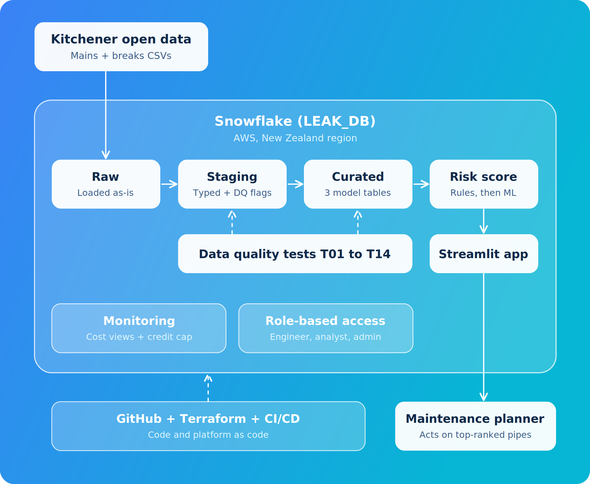

## Overview

Public pipe and break data from the City of Kitchener lands in Snowflake untouched gets cleaned and quality-checked, is turned into one row per pipe per year, is scored and ranked for failure risk, and is shown to a maintenance planner on a dashboard.
All inside Snowflake on AWS, with roles, cost limits and CI/CD wrapped around it.

## Diagram

