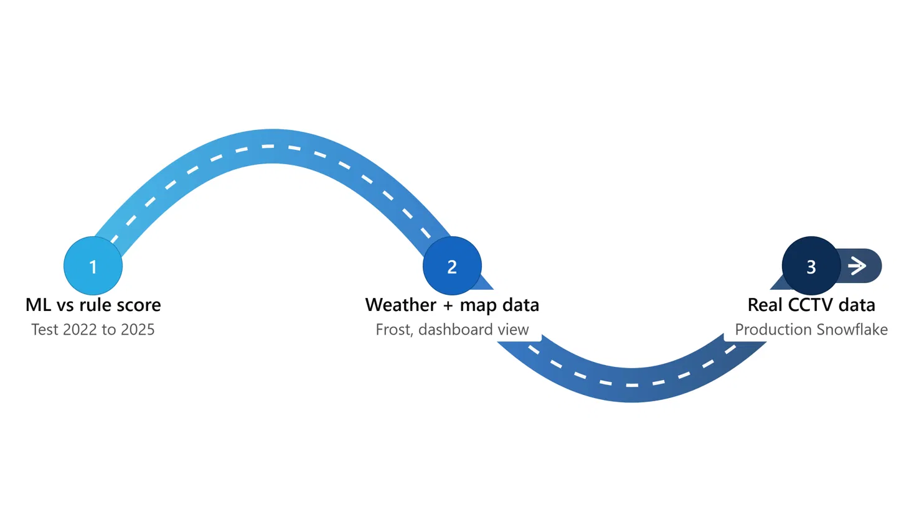

# Future roadmap

If we had more time beyond the datathon, here's what we'd tackle next, sorted from most realistic/near-term to longest-term:

1. **ML vs rule score** — finish testing the ML model against the rule-based score on 2022–2025 data, and only promote it if it actually beats the explainable baseline.
2. **Weather + map data** — bring in frost/weather data to help explain the winter spike in breaks, and add a map view to the dashboard so planners can see risk geographically.
3. **Real CCTV data** — move off the trial Snowflake account onto a production setup and bring in real inspection/CCTV data, which is the biggest source of early-warning signal that break history alone can't give us.
