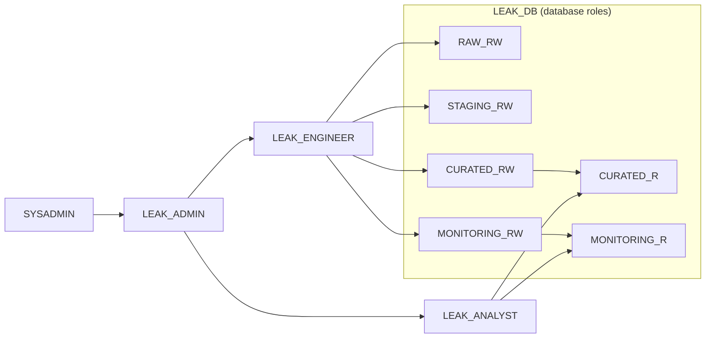

# Platform: Snowflake setup, Terraform, CI/CD and cost monitoring

This folder builds the Snowflake platform everything else runs on.

**Status:** the platform is live and in use by the team. Terraform has adopted it, and `terraform plan` reports **No changes**, so the code matches the live account. CI checks every pull request, and `main` is branch-protected.

| What | Where |
|---|---|
| IaC + release process | `terraform/` + `.github/workflows/terraform.yml` |
| RBAC (objects → database roles → account roles) | `bootstrap/00_hour0_setup.sql`, `terraform/rbac.tf` |
| Warehouse optimisation | `terraform/compute_and_cost.tf` |
| Monitoring (resource monitor, cost views, alerts) | `terraform/compute_and_cost.tf`, `sql/` |

## How it was built: by hand first, then Terraform

1. **Hour 0: unblock the team.** `bootstrap/00_hour0_setup.sql` was run by hand in about 15 minutes, so everyone could start working straight away.
2. **Then: codify it.** Terraform *adopted* (imported) exactly what the script created, with the same names. Since then, platform changes go through Terraform.

This is how many real teams adopt infrastructure as code: set up by hand to unblock the team, then codify the live platform.

**Names are fixed once the script has run.** `terraform/locals.tf` copies them from the script, and the tests check they match.

## What gets created

| Object | Name | Notes |
|---|---|---|
| Resource monitor | `LEAK_RM` | 40 credits for the whole trial; notify 50% / 75%, suspend 80%, hard stop 95% |
| Warehouse | `LEAK_WH` | XSMALL, auto-suspend 60 s, 10 min query timeout, single cluster |
| Database | `LEAK_DB` | Schemas `RAW`, `STAGING`, `CURATED`, `MONITORING` |
| Database roles | `RAW_RW`, `STAGING_RW`, `CURATED_RW`, `MONITORING_RW`, `CURATED_R`, `MONITORING_R` | Hold the object privileges |
| Account roles | `LEAK_ENGINEER`, `LEAK_ANALYST`, `LEAK_ADMIN` | What people log in with |
| Users | `KHALID`, `WAYNE`, `ARITHA`, `SUN`, `KARLO` | Must change password at first login |

### RBAC design



(Arrows point from the role that holds a grant to the role it inherits.)

| Person | Role | What they can do |
|---|---|---|
| Jibin, Khalid | `LEAK_ADMIN` | Everything below, plus resize the warehouse and read account usage data |
| Wayne, Aritha, Sun | `LEAK_ENGINEER` | Create and change anything in all four schemas; register ML models in `CURATED` |
| Karlo | `LEAK_ANALYST` | Read `CURATED` and `MONITORING` only |

- **Future grants**: every table or view created later is readable by the right roles automatically. Nobody runs manual `GRANT`s.
- **Least privilege**: the analyst can't see `RAW` or `STAGING`. Demo it: log in as Karlo and run `SELECT * FROM LEAK_DB.RAW.<table>`. It fails.
- **Cortex AI** is granted explicitly (`SNOWFLAKE.CORTEX_USER`) to ENGINEER and ANALYST (ADMIN inherits it).
- **Build as `LEAK_ENGINEER`**, not `LEAK_ADMIN` or `ACCOUNTADMIN`. Whoever creates a table owns it, and tables owned by admin roles can't be replaced by the team or dbt.

---

## Part A: hour-0 setup (done)

Steps to reproduce on a new account:

1. **Snowflake trial account**: **Enterprise** edition, **AWS**, **Asia Pacific (Sydney)**. Add a credit card (Admin → Billing): trials have AI features switched off until you do, but you still use the free credits.
2. **Verify your email** (profile menu → email). Credit-limit warnings only go to verified addresses.
3. Open `bootstrap/00_hour0_setup.sql`, copy it into a Snowsight worksheet, and **replace the placeholder emails and password in the worksheet only** (never in the file: this repo is public).
4. Run it as `ACCOUNTADMIN` in **two steps** (also explained at the top of the script):
   - **Step 1:** run the statements under `STEP 1` one at a time: cursor in the statement, **Ctrl+Enter**. This switches on multi-statement mode and creates the credit limit and `LEAK_WH`, which Run All needs to be running from its first statement.
   - **Step 2:** choose **Run All** (arrow next to Run, or Ctrl+Shift+Enter). Section 7 should finish with no errors.
5. Put the starter warehouse under the same guardrails (new trials come with `SNOWFLAKE_LEARNING_WH`, which isn't covered by `LEAK_RM`):
   ```sql
   ALTER WAREHOUSE SNOWFLAKE_LEARNING_WH SET AUTO_SUSPEND = 60 RESOURCE_MONITOR = LEAK_RM;
   ```
6. Run `sql/10_cost_monitoring_views.sql` as `LEAK_ADMIN`. It creates the cost views for the Platform health tab. Run a few queries early: usage data lags by up to 3 hours.
7. Send each person their username, the temporary password and their role. They log in and change their password.

*Optional, if there's time:* `sql/20_budget_and_alerts.sql` as `ACCOUNTADMIN` (replace `YOUR_EMAIL@example.com` first). If a Budget statement fails on the trial, skip it.

**If the script fails in Snowsight**

| Error | Cause | Fix |
|---|---|---|
| `Actual statement count N did not match the desired statement count 1` | Multi-statement mode is off, or a comment contains an apostrophe | Run the `ALTER SESSION SET MULTI_STATEMENT_COUNT = 0;` line first; keep apostrophes out of comments |
| `No active warehouse selected in the current session` | Run All started before `LEAK_WH` existed | Do Step 1 first (ends with `USE WAREHOUSE LEAK_WH;`) |
| `Unsupported feature GRANT/REVOKE CREATE NOTEBOOK ON SCHEMA` | This account does not support that permission at all | Fixed: the script no longer grants it |
| `User 'JJOY283' does not exist or not authorized` | Trial sign-up usernames are lower case; unquoted names are upper-cased by Snowflake | Fixed: the script quotes the name (`SET me = '"' \|\| CURRENT_USER() \|\| '"'`) |

---

## Part B: bring it under Terraform (done)

Steps to reproduce:

### 1. Install tools

- Terraform ≥ 1.7: https://developer.hashicorp.com/terraform/install
- OpenSSL (use Git Bash on Windows)

### 2. Create Terraform's login

```bash
bash infra/bootstrap/generate_keys.sh
```

Then run `bootstrap/01_snowflake_bootstrap.sql` in Snowsight as `ACCOUNTADMIN`, after pasting in the public key it printed. Note the organization and account names it shows.

### 3. Configure

```bash
cd infra/terraform
cp terraform.tfvars.example terraform.tfvars   # git-ignored
```

Fill in the organization/account names, your own login (`trial_owner_user`), and **the same teammate emails you used in the worksheet**.

### 4. Test, plan, and read the plan carefully

```bash
terraform init
terraform test      # unit tests, no Snowflake needed
terraform plan
```

What a good first plan looks like:

| Plan says | Meaning | OK? |
|---|---|---|
| **21 to import** | Monitor, warehouse, database, 4 schemas, 6 database roles, 3 account roles, 5 users | ✅ expected |
| **~50 to add** | Grants. Snowflake already has them; re-granting does nothing | ✅ expected |
| **a few to change** | Small in-place tidy-ups (e.g. a user's email or display name) | ✅ read them, usually fine |
| **anything to destroy or "must be replaced"** | Terraform would delete something | ❌ **stop**, don't apply, ask for help |

The database and schemas also have `prevent_destroy`, so Terraform refuses to delete them even by mistake.

**What happened on our first plan:** it wanted to destroy and recreate all four schemas, because the provider's default for `is_transient` did not match what Snowflake reported. `prevent_destroy` blocked it. Pinning `is_transient = "false"` in `database.tf` fixed it, and the plan then matched this table.

### 5. Apply

```bash
terraform apply     # type 'yes'
terraform plan      # should now say: No changes
```

That "No changes" is the proof that the code matches the live platform. `terraform.tfstate` now exists in this folder: **don't delete it and don't commit it**.

**Working rules after this point**
- Only **Jibin** runs `terraform apply` (the state file lives on his laptop).
- Platform changes (new teammate, new role, warehouse settings) = edit Terraform + `apply`, not Snowsight.
- Tables, views, models and apps the team builds are **not** in Terraform, and Terraform never touches them.

---

## Cost controls: what covers what

| Control | Covers | Doesn't cover |
|---|---|---|
| Resource monitor `LEAK_RM` | Warehouse compute (hard stop) | Serverless, Cortex AI, storage |
| Warehouse settings | Idle cost (60 s suspend), runaway queries (10 min timeout) | — |
| `QUERY_TAG` + `V_CREDITS_BY_QUERY_TAG` | Which workload spent the credits | — |
| *Optional:* Budgets + hourly alert (`sql/20_…`) | Serverless + AI spend, fast email warning | Not a hard stop |

**Why one warehouse?** Creating a warehouse per use case multiplies idle cost and minimum billing. Size matters just as much: **each size up doubles the credit rate** (XSMALL = 1 credit/hour, SMALL = 2, MEDIUM = 4), which is why only `LEAK_ADMIN` can resize. We use one XSMALL warehouse and attribute cost with query tags. If a job is slow, an admin can **resize it temporarily** (`ALTER WAREHOUSE LEAK_WH SET WAREHOUSE_SIZE = SMALL`, then back) instead of creating another warehouse.

Ask teammates to set a query tag, for example:
- dbt: `query_tag: dbt` in `dbt_project.yml`
- Streamlit: `session.sql("ALTER SESSION SET QUERY_TAG = 'streamlit'").collect()`
- ML notebook: `ALTER SESSION SET QUERY_TAG = 'ml'`

---

## CI/CD

`.github/workflows/terraform.yml` runs on every PR and push to `main` that touches `infra/terraform`:

`terraform fmt -check` → `validate` → `terraform test` (mocked provider, no secrets needed).

`main` is branch-protected: changes need a pull request, so broken Terraform can't be merged.

---

## Next steps

- **DEV/PROD split**: a second database with its own roles, with CI deploying merged code to PROD.
- **Remote state in S3** + GitHub OIDC, so CI runs `plan` on PRs and `apply` on merge.
- **Service users** (key-pair auth) for dbt in CI and Lambda/Snowpipe ingestion.
- **AWS in the same Terraform**: S3 data bucket, storage integration, IAM role, AWS Budget.

## Known limitations

- The platform was bootstrapped by hand and adopted by Terraform later, so for the first hours Terraform wasn't the source of truth.
- Terraform runs as `ACCOUNTADMIN` (trial simplification). Production would use a dedicated role with only the privileges it needs.
- Human users start with a shared temporary password. Production would use SSO/SCIM instead.
- One environment: changes go straight to the only database. Mitigated by CI checks and a small team.
- State is local, so only one person can run `terraform apply`.
- `ACCOUNT_USAGE` views lag by up to about 3 hours.
